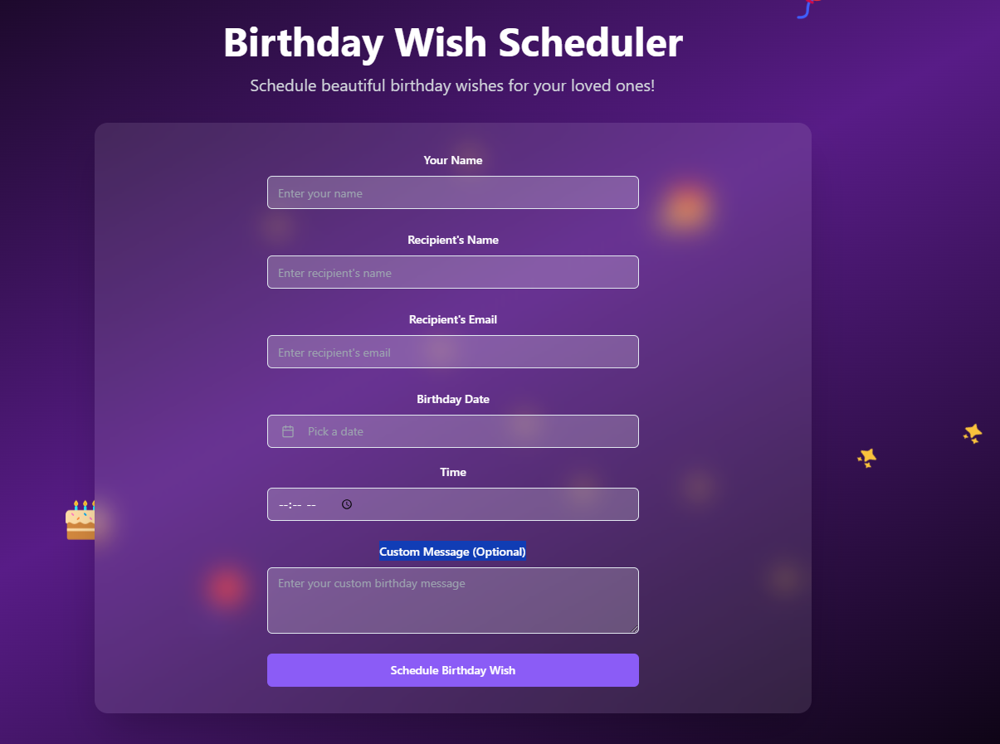
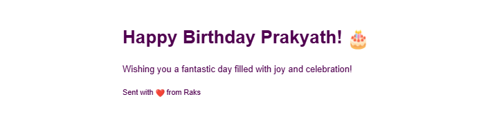

# 🎉Birthday Wisher Emailer!🎉

## Getting started

You can view a live demo over at https://birthday-emailer.kollaprakyath.dev/

**Use your preferred IDE**

If you want to work locally using your own IDE, you can clone this repo and push changes. Pushed changes will also be reflected in Lovable.

The only requirement is having Node.js & npm installed - [install with nvm](https://github.com/nvm-sh/nvm#installing-and-updating)

Follow these steps:

```sh
# Step 1: Clone the repository using the project's Git URL.
git clone <YOUR_GIT_URL>

# Step 2: Navigate to the project directory.
cd <YOUR_PROJECT_NAME>

# Step 3: Install the necessary dependencies.
npm i

# Step 4: Start the development server with auto-reloading and an instant preview.
npm run dev
```

## Usage:
# In the current scenario we sometimes miss wishing close people on the most auspicious day. So I created this for scheduling their birthday wishes using this application and incase if you miss it this application does it for you. 
# Enter the `Your name , Recipient's Name , Recipient's Email, Birthday Date, Time and Custom Message (Optional) for sending any custom message`



And There You Go ! 🎉

# Integrated it with SendGrid for sending the email to Recipient's Email by configuring the email id.
# Integrated it with Supabase for storing the scheduled birthday wishes.



## What technologies are used for this project?

This project is built with .

- Vite
- TypeScript
- React
- shadcn-ui
- Tailwind CSS
