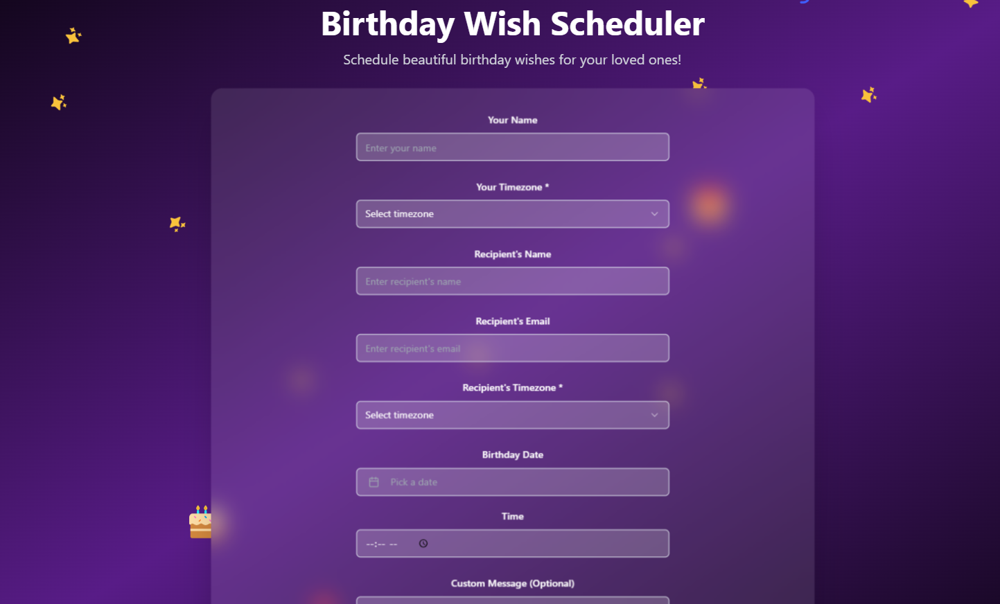

# 🎉Birthday Emailer!🎉

## 🔗 Live Demo

[Visit Birthday Website](https://birthday-emailer.kollaprakyath.dev/)

---

**To Run Locally**

The only requirement is having Node.js & npm installed - [install with nvm](https://github.com/nvm-sh/nvm#installing-and-updating)

Follow these steps:

```sh
# Step 1: Clone the repository using the project's Git URL.
git clone <YOUR_GIT_URL>

# Step 2: Navigate to the project directory.
cd <YOUR_PROJECT_NAME>

# Step 3: Install the necessary dependencies.
npm i

# Step 4: Start the development server with auto-reloading and an instant preview.
npm run dev
```
---

## Usage:
In the current scenario we sometimes miss wishing close people on the most auspicious day. So I created this for scheduling their birthday wishes using this application and incase if you miss it this application does it for you.

Create an account using Email and give the password and then click signup and you will receive an email with which you can login and from next time you can enter email and password and click signin.

---


---

Enter the `Your name , Your Timezone, Recipient's Name , Recipient's Email, Recipient's Timezone, Birthday Date, Time and Custom Message (Optional) for sending any custom message`

---


And There You Go ! 🎉

---

Integrated it with `SendGrid` for sending the email to Recipient's Email by configuring the email id.

Integrated it with `Supabase` for storing the scheduled birthday wishes.

---


---

Handled all the `timezone` issues in the backend. So you can just enter the time at which recipient should receive in their timezone and it will be done.

Configured the cron job running every minute to trigger email when the date and time is matched with current time in their respective timezone.

Used `IANA Timezone` for this.

---

## License
This project is licensed under the MIT License - see the [LICENSE](LICENSE) file for details.

---

## What technologies are used for this project?

This project is built with .

- Vite
- TypeScript
- React
- shadcn-ui
- Tailwind CSS
